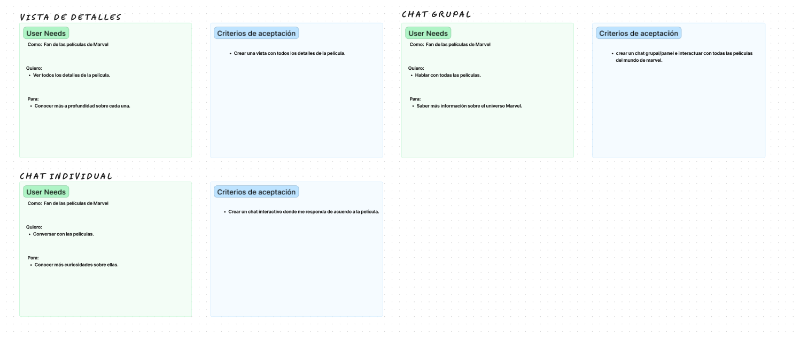
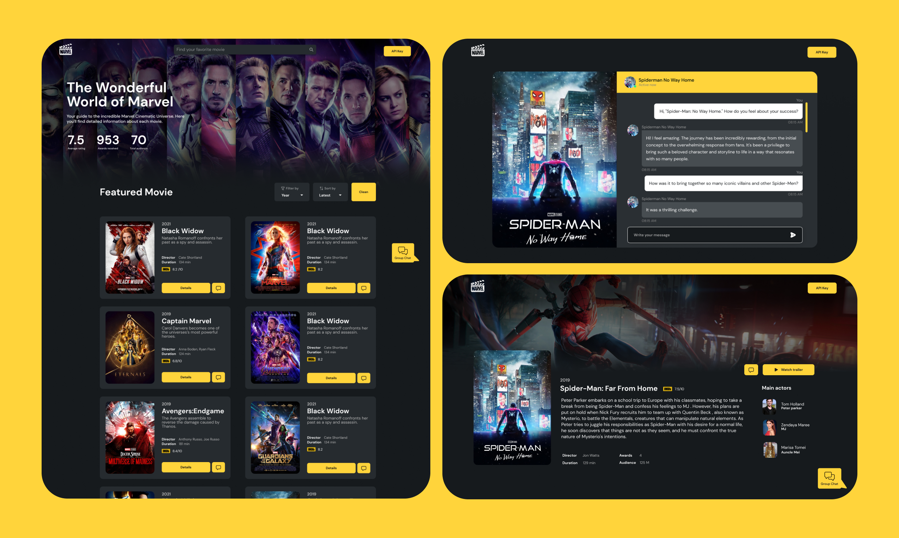

# Marvel Movies Project

## Definición del Producto

**Marvel Movies Project** es una aplicación web que permite a los usuarios explorar y obtener información detallada sobre las películas del Universo Cinematográfico de Marvel (MCU). Los usuarios pueden filtrar y ordenar las películas según diferentes criterios, acceder a detalles específicos de cada película, y conversar las películas a través de un chat interactivo. Además, el proyecto cuenta con un chat grupal donde el usuario puede conversar con todas películas del universo Marvel. Adicionalmente se agregó un buscador para que el usuario pueda encontrar las películas fácilmente y la interfaz está diseñada para ser responsive.

## Historias de Usuario
  

## Diseño de la Interfaz de Usuario

- **Prototipo de Alta Fidelidad:**
  

## Funcionalidades de la Interfaz de Usuario (UI)

- **Pantalla Principal:**
  - [ ] Permite ver toda la data en la pantalla principal con opciones para filtrar y ordenar.

- **Página de Detalles:**
  - [ ] Permite ver una página con más detalles de cada entidad. En esta página se puede iniciar el chat.

- **Chat Individual:**
  - [ ] Permite conversar con el personaje o entidad de la data a través de un chat.

- **Chat Grupal:**
  - [ ] Permite chatear de forma grupal con todas las entidades de la data.

- **Responsive:**
  - [ ] Se elaboró un diseño responsive para celulares.
